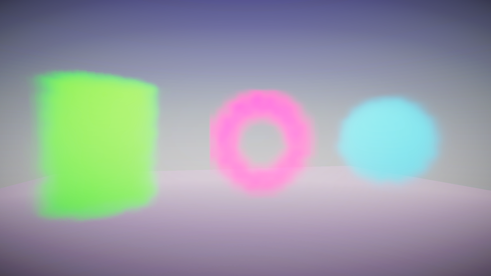
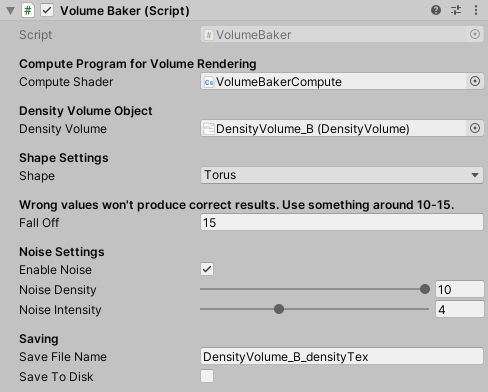

# HDRPDensityVolumeBaker

A HDRP Density Volume Mask Texture Baker

As far as I know HDRP does not currently support rendering of density volume textures and it's a bit tedious to create those in some external software as an image sheet and then process the images with the Create Density Volume Texture tool to a Texture3D...

So I thought to check how difficult it would be to create a renderer that produces volume textures in required format, right inside Unity.

The results really don't look that fancy as the resolution isn't that great (32x32x32) and there's some artifacts etc. But these can most likely be at least partially hidden with some trickery etc.

This is just my proof of concept prototype.

For more information about what Density Volumes are, check the Unity HDRP documentation.

## Features

- Produces a volume texture in Texture3D format
- Uses a compute shader to render the volume texture
- A few shapes to test this out
- Possibility to add noise
- Can save the texture as an asset to the project folder

## Notes

Compute shader part uses Ashima Arts noise library translated and modified by Keijiro Takahashi. [source](https://github.com/keijiro/NoiseShader)

This test project works with Unity 2019.3.0f6 and HDRP 7.1.8.

## A Few Density Volume textures in use

## UI

